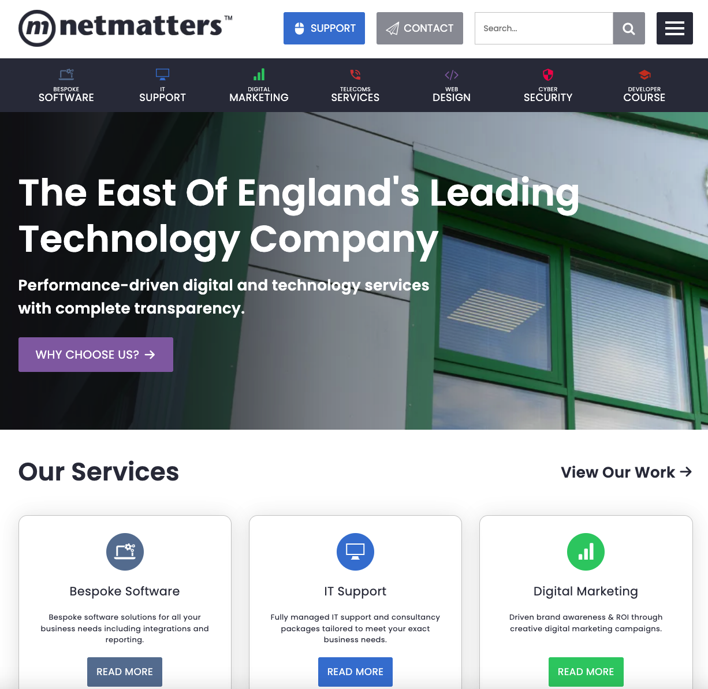

# Netmatters Homepage Clone

A clone of the [Netmatters Homepage](https://www.netmatters.co.uk/).



## Demo

Here is a working live demo: https://kapaha.github.io/netmatters-homepage-clone/

## Tech Stack

-   HTML
-   SCSS
-   Vite

## Setup & Installation

1. Clone the repository

    ```bash
    git clone git@github.com:kapaha/netmatters-homepage-clone.git
    cd netmatters-homepage-clone
    ```

2. Install dependencies

    ```bash
    npm ci
    ```

3. Run the development server
    ```bash
    npm run dev
    ```

## Building for Production

To create an optimized version of the app

```bash
npm run build
```

## Status

The project is finished, however I may continue to improve on it as my knowledge of web development improves.
